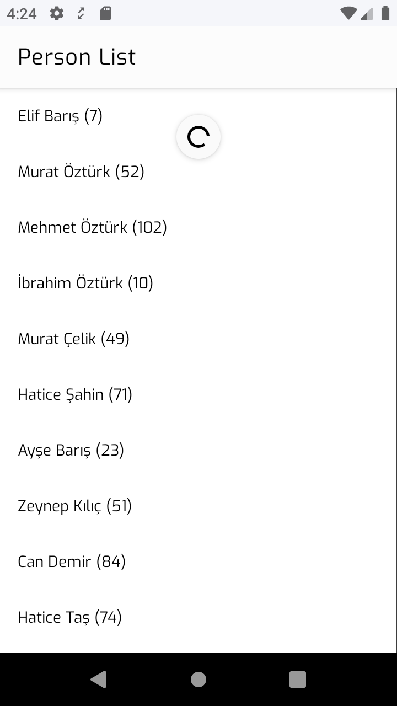

# Person List

## TODO
- [X] Every person that is listed has an `id` and a `fullName`
- [X] There are lots of people to list and only a small subset of them can be retrieved from our `DataSource` at once. So we need a "pagination" mechanism.
- [X] There should be a "Pull to Refresh" functionality for refreshing the list.
- [X] Proper error handling and a retry implementation is required.
- [X] When there is no one for listing, a proper message should be displayed. Also, in this case, we need to implement a functionality to refresh the list.
- [X] Listing should be unique by person `id`. Duplicate items are not allowed. (People who have same `fullName`s but different 'id's are allowed.)

## Screenshots
